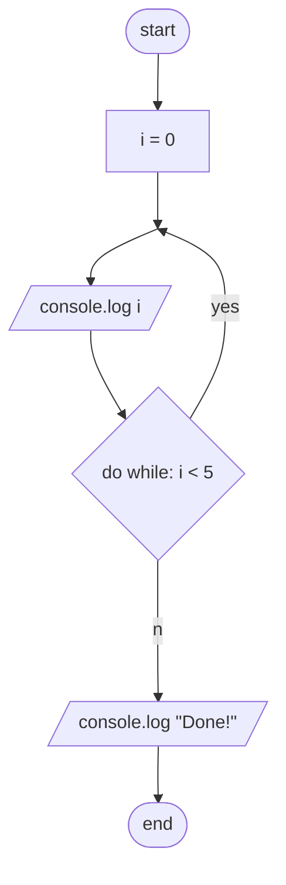

```mermaid
flowchart TD
N1([start])
N2["i = 0"]
N1 --> N2
N3[ ]
    style N3 fill:none,stroke:none,color:none,width:0,height:0
N2 --> N3
N4[/"console.log i"/]
N3 --> N4
N5{"do while: i < 5"}
N4 --> N5
N5 --yes--> N3
N7[/"console.log &quot;Done!&quot;"/]
N5 --no--> N7
N8([end])
N7 --> N8
```
